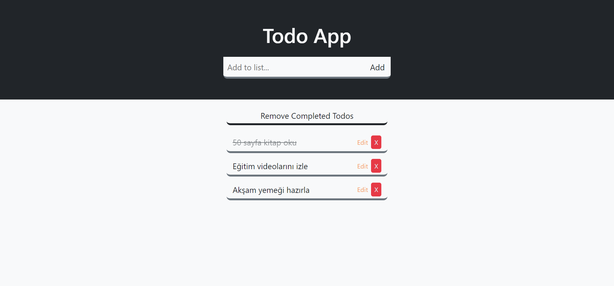

# Todo App with JavaScript


# 📌 Installation

### Clone
   ```bash
   git clone https://github.com/135-Inveon-FullStack-Bootcamp-Classroom/mehmet_mutlu_homeworks.git
   ```

### Install
   ```bash
   npm install
   ```

### Nuild
   ```bash
   npm run build
   ```

### Start
   ```bash
   npm run start
   ```

# 🧰 Toolbox

<ul style="list-style-type:disc">
   <li><a href="https://webpack.js.org/">Webpack</a></li>
   <li><a href="https://getbootstrap.com/">Bootstrap</a></li>
</ul>

# 🎞 Screenshot


