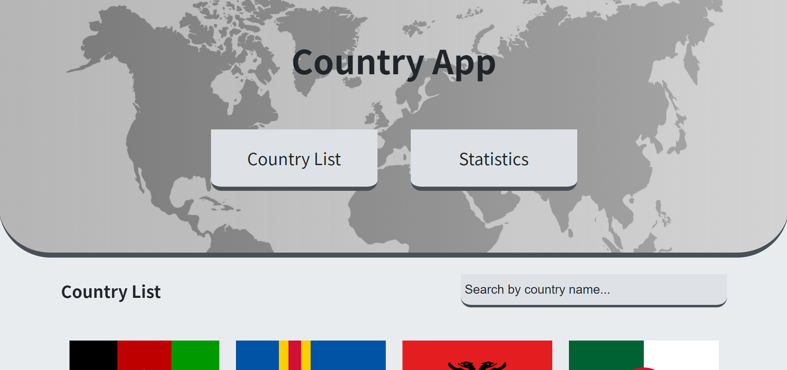
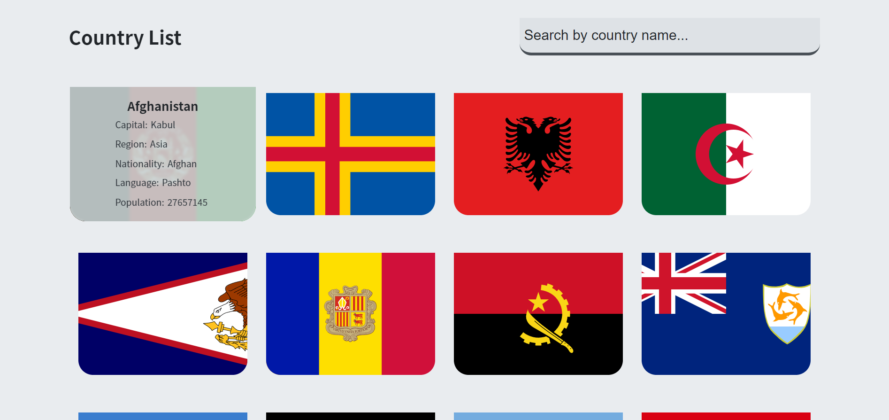
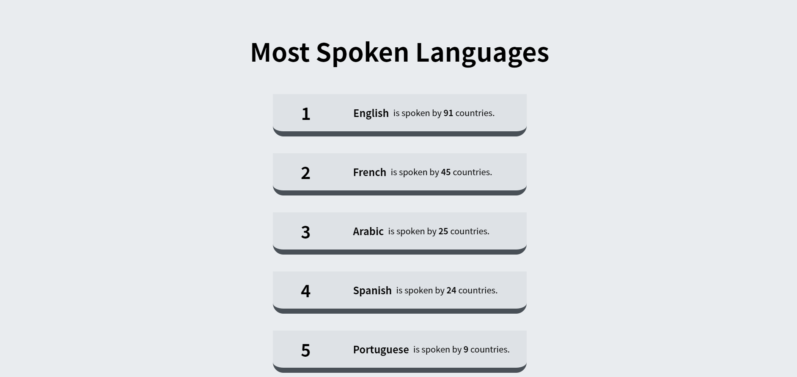

# ⚛️ Country App with ReactJS

I have coded this app as a homework for third week to show my learning outcomes about API calls.

<h3><a href="https://react-country-app-mhmtmtlu.netlify.app/">Live Preview</a></h3>

# 🧰 Toolbox

<ul style="list-style-type:disc">
   <li><a href="https://reactrouter.com/web/guides/quick-start">React Router</a></li>
   <li><a href="https://styled-components.com/docs">Styled Components</a></li>
   <li><a href="https://www.framer.com/docs/">Framer Motion</a></li>
   <li><a href="https://www.npmjs.com/package/axios">Axios</a></li>
   <li><a href="https://restcountries.com/">Rest Countries API</a></li>
</ul>

# 🎞 Screenshot

